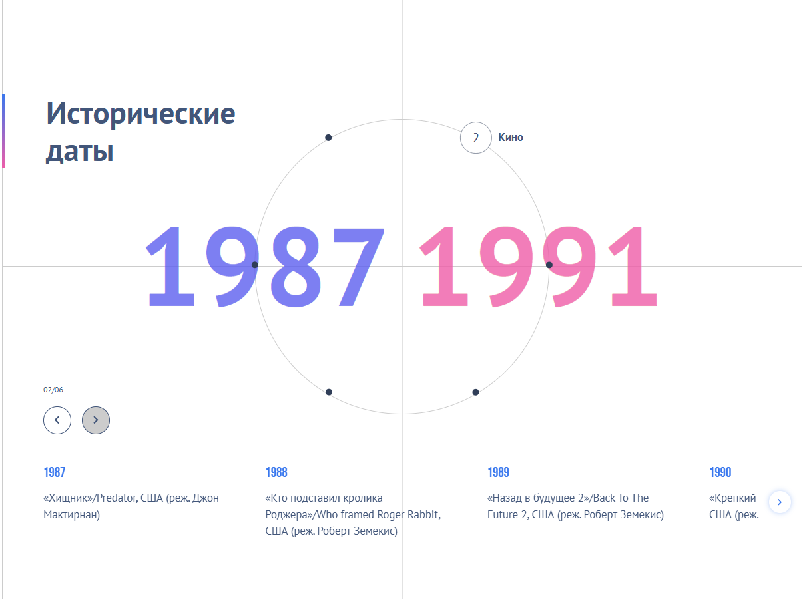

## DATES-SLIDER

### Интерактивный компонент со слайдером

-   [Деплой проекта на Vercel](https://dates-slider.vercel.app/)

---

### Как запускать проект

1. `npm install`

2. `npm run start` или `npm run build`

---

### Стек технологий проекта:

#### Основные зависимости:

-   React и ReactDOM

-   Swiper.js (для слайдера)

-   GSAP (для анимаций)

-   Styled-components (для стилизации)

#### Dev зависимости:

-   Webpack и его плагины

-   Babel для транспиляции

-   TypeScript, @types-пакеты

-   Pug и SCSS loaders
